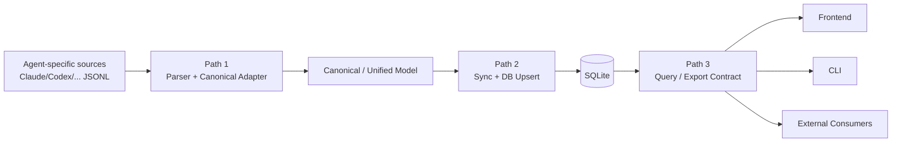

# Architecture

Developer documentation for the Agent Trajectory Profiler.

## Bird's Eye View

Agent Trajectory Profiler is a full-stack tool that ingests local multi-agent trajectory files (currently Claude Code and Codex JSONL), normalizes them into an agent-neutral contract, computes quantitative analytics (token usage, time attribution, tool latency, bash command breakdown), and surfaces them through four channels: a FastAPI REST API, a React web dashboard, a Click CLI, and an SQLite database for incremental persistence. An `analyze` command invokes `claude -p` headless to produce AI-powered qualitative reports.

The backend is Python (Pydantic models, single-pass parser, FastAPI endpoints, SQLite persistence). The frontend is a React 19 SPA with React Query, Recharts, and TailwindCSS 4. The parser layer is extensible via an abstract base class and canonical adapters so ecosystems can evolve independently from downstream consumers.

## Design Philosophy: Three Paths

The repository follows a strict three-path architecture. This is the governing design philosophy for code review and feature planning.

### Path 1: Agent Source -> Canonical Contract

- Input: ecosystem-specific source files and event shapes (`~/.claude/projects`, `~/.codex/sessions`, future ecosystems).
- Core responsibility: isolate source differences in parser/adapter layer and normalize records.
- Output: canonical event stream plus unified domain model (`MessageRecord`, `Session`, `SessionStatistics`).
- Ownership: `agent_vis/parsers/*` and capability manifests.

### Path 2: Canonical Contract -> Database Sync

- Input: canonical/unified session objects.
- Core responsibility: incremental sync, idempotent upsert, parse status tracking, and durability.
- Output: stable SQLite storage contract (`tracked_files`, `sessions`, `session_statistics`).
- Ownership: `agent_vis/db/*`, `agent_vis/api/service.py` sync orchestration.

### Path 3: Database -> Query/Export Contract

- Input: persisted canonical-derived records.
- Core responsibility: provide stable, consumer-facing query/export semantics.
- Output classes:
  - session and cross-session analytics summaries
  - full trajectory detail payloads
  - timestamp annotation payloads for key timeline events
- Ownership: API response models/endpoints, CLI export surfaces, frontend adapter layer.

## Terminology and Boundaries

- `source format`: original ecosystem event schema and storage layout.
- `canonical format`: agent-neutral normalized event/session contract used to bridge ecosystem differences.
- `storage model`: database schema and persistence semantics (incremental sync, parse status, idempotency).
- `query contract`: stable response/serialization contract for UI, CLI, and external integrations.

The architecture deliberately separates these terms. A valid design keeps these boundaries explicit.

## Standards First Rule

Contract definitions are not owned by UI components. Frontend is one consumer of Path 3, not the source of truth for Path 1/2/3 semantics.

Anti-patterns (do not do this):

- Embedding ecosystem-specific parsing assumptions directly in React components (for example, branching core metric math by `ecosystem` in view code).
- Deriving API contract semantics from chart rendering behavior (for example, treating absent fields as zero without capability/fallback definition).

## New Ecosystem Onboarding (Minimum Checklist)

1. Add parser and canonical adapter implementation for the ecosystem.
2. Add/update capability manifest declaring supported event/token/error dimensions.
3. Define source discovery rules and session identity strategy (logical/physical lineage).
4. Add parser and integration tests covering normalization, fallback behavior, and sync.
5. Update standards docs and ecosystem docs before merging parser behavior changes.

## Standards Index

- Agent ecosystem docs: `docs/agents/*`
- Capability manifest spec: `docs/agent-capability-manifest.md`
- Canonical trajectory schema: `docs/standards/canonical-trajectory-schema.md`
- Canonical-to-DB sync contract: `docs/standards/canonical-db-sync-contract.md`
- Query/export contract: `docs/standards/query-export-contract.md`
- Capability coverage matrices: `docs/standards/metric-capability-matrix.md`, `docs/standards/timestamp-annotation-capability-matrix.md`

## Code Map

### `agent_vis/models.py`

Type backbone. All Pydantic v2 models: `MessageRecord`, `Session`, `SessionMetadata`, `SessionStatistics`, `TimeBreakdown`, `TokenBreakdown`, `BashBreakdown`, `ToolCallStatistics`, `ToolGroupStatistics`, `CompactEvent`. Domain types live here, API response types live in `api/models.py`.

### `agent_vis/exceptions.py`

Centralized exception definitions. `SessionParseError` for all parse failures.

### `agent_vis/parsers/`

Core parser layer with ecosystem extensibility.

- `base.py` — `TrajectoryParser` ABC defining the interface: `parse_file()`, `extract_metadata()`, `calculate_statistics()`, `find_session_files()`, `parse_session()`
- `canonical.py` — Canonical conversion middle layer:
  - `CanonicalEvent` / `CanonicalSession` agent-neutral models
  - `TrajectoryEventAdapter` contract (`to_canonical_event()` and `canonical_to_message()`)
  - adapter registry (`register_adapter()`, `get_adapter()`, `list_adapters()`)
  - conversion helpers: `parse_jsonl_to_canonical()` and `canonical_to_messages()`
- `claude_code.py` — `ClaudeCodeParser` class implementing the ABC. Contains all parsing logic as module-level functions (single-pass loop, tool tracking, time attribution, bash breakdown, compact event extraction)
- `codex.py` — `CodexParser` class for local Codex rollout logs (`~/.codex/sessions/**/rollout-*.jsonl`) mapped into the same internal analytics model
- `registry.py` — Parser registry with `register_parser()` / `get_parser(ecosystem)` factory. Auto-registers `ClaudeCodeParser` for `"claude_code"` ecosystem
- `session_parser.py` — Backward-compatibility shim re-exporting from `claude_code.py`
- `__init__.py` — Public API: `parse_session_file()`, `parse_session_directory()`, `SessionParseError`, `ClaudeCodeParser`

**Parser algorithm** (in `claude_code.py`):
0. **Canonical conversion** — each source JSONL line is normalized through ecosystem adapter:
   `source json -> CanonicalEvent -> MessageRecord`
1. **Message counting** — user, assistant, system counts
2. **Token accumulation** — input, output, cache read, cache creation
3. **Tool tracking** — `tool_use_map` maps `tool_use_id → (tool_name, timestamp)`. When a matching `tool_result` arrives, latency = `result_ts - use_ts`.
4. **Time attribution** — gap analysis between consecutive messages:
   - Gap > 30min → inactive (excluded from active time)
   - Gap → assistant → model inference time
   - Gap → user with `tool_result` → tool execution time
   - Gap → user without `tool_result` → user idle time
5. **Post-loop** — build `TimeBreakdown`, `TokenBreakdown`, per-tool avg latency
6. **Bash breakdown** — `_split_bash_on_operators()` (quote-aware splitting on `&&`, `||`, `;`, `|`) → `_parse_bash_sub_commands()` → per-command stats
7. **Compact events** — `extract_compact_events()` reads `compact_boundary` system messages directly from JSONL

### `agent_vis/db/`

SQLite persistence layer for incremental session parsing.

- `schema.py` — DDL for `tracked_files`, `sessions`, `session_statistics` tables with indexes. `create_tables(conn)` function
- `connection.py` — `get_connection(db_path)` with WAL mode, foreign keys enabled. Default path: `~/.agent-vis/profiler.db`
- `repository.py` — `SessionRepository` CRUD: tracked file management, session upsert/query with sort/pagination, statistics JSON serialization via `model_dump_json()` / `model_validate_json()`
- `sync.py` — `SyncEngine` with incremental detection (mtime + file_size comparison), returns `SyncResult(parsed, skipped, errors)`

### `agent_vis/formatters/`

Multi-level output formatters for CLI human-readable output.

- `human.py` — `OutputLevel` IntEnum (SUMMARY=1, STANDARD=2, DETAILED=3), `format_session_stats(stats, session_id, level)` public API. Level 1 is single-line, Level 2 is the standard `--human` output, Level 3 adds all tools, all bash commands, and compact events.

### `agent_vis/api/`

FastAPI application layer.

- `app.py` — FastAPI app with lifespan (DB initialization + auto-sync), endpoints, SPA catch-all fallback
- `config.py` — `Settings` class (env var prefix `AGENT_VIS_`), `@lru_cache get_settings()`. Includes `db_path` setting.
- `service.py` — `SessionService`: reads from SQLite with in-memory fallback. Provides paginated listing with sort, on-demand session detail parsing, statistics lookup.
  - auto-syncs mixed local sources (`~/.claude/projects` + `~/.codex/sessions`) using parser registry
- `models.py` — API response models (`SessionSummary`, `SessionListResponse`, `SyncStatusResponse`, `ErrorResponse`)

Endpoints:
- `GET /api/sessions` — paginated session list (from DB), includes `ecosystem` and supports `ecosystem` query filtering
- `GET /api/sessions/{id}` — full session detail with messages
- `GET /api/sessions/{id}/statistics` — computed statistics
- `GET /api/sync/status` — sync database status
- `GET /health` — health check

### `agent_vis/cli/`

Click CLI entry point (`main.py`). Five subcommands:

- `serve` — starts uvicorn with optional hot reload, auto-builds frontend
- `parse` — headless JSONL parsing, outputs JSON or human-readable stats (`--level 1/2/3`)
- `sync` — incrementally scan and parse session files into SQLite
- `stats` — query session statistics from the database
- `analyze` — parses session, builds prompt via `build_analyze_prompt()`, invokes `claude -p` subprocess, writes Markdown report

### `agent_vis/prompts/`

Prompt templates for the `analyze` command.

- `analyze.py` — EN/CN prompt templates (`_ANALYZE_PROMPT_EN`, `_ANALYZE_PROMPT_CN`), system roles, and `build_analyze_prompt(stats_text, jsonl_file_path, session_id, lang) → (prompt, system_role)`

### `frontend/src/`

React 19 SPA with 3 tabs: Timeline, Statistics, Analytics.

- `App.tsx` — tab routing, session selection
- `components/` — `SessionSelector`, `MessageTimeline`, `StatisticsDashboard`, `AdvancedAnalytics`, `SubagentSession`, `SessionMetadataSidebar`
- `hooks/useSessionsQuery.ts` — React Query hooks for API fetching with caching
- `utils/analyticsComputer.ts` — client-side derivation of heatmaps, bottlenecks, recommendations
- `utils/exportData.ts` — CSV/JSON export
- `api/sessions.ts` — API client functions

### `tests/`

Pytest test suite. Fixtures in `conftest.py` (composable). Test data in `tests/fixtures/` (gitignored).

- `test_models.py` — Pydantic model validation
- `test_parser.py`, `test_parser_integration.py` — JSONL parsing
- `test_statistics.py`, `test_statistics_integration.py` — stat computation
- `test_repository.py` — SQLite repository CRUD
- `test_sync.py` — SyncEngine incremental detection
- `test_api_integration.py`, `test_full_stack_integration.py` — API and E2E

## Entry Points

- **CLI**: `agent_vis/cli/main.py:main` (registered as `agent-vis` in pyproject.toml)
- **API**: `agent_vis/api/app.py:app` (FastAPI ASGI application, started by uvicorn)
- **Frontend**: `frontend/src/main.tsx` (React entry, bundled by Vite)

## Cross-Cutting Concerns

- **Error handling**: Custom `SessionParseError` in `exceptions.py` for parse failures. CLI catches and reports to stderr. API uses global exception handler returning `ErrorResponse`.
- **Configuration**: `pydantic-settings` with `AGENT_VIS_` env var prefix. CLI flags override settings.
- **Persistence**: SQLite with WAL mode at `~/.agent-vis/profiler.db`. Incremental sync via mtime + file_size comparison. Statistics stored as JSON blobs.
- **Caching**: API service reads from SQLite, falls back to in-memory parsing. React Query caches API responses client-side.
- **Serialization**: Pydantic `model_dump(mode="json")` for API responses and CLI JSON output. `model_dump_json()` / `model_validate_json()` for DB statistics storage.

## Invariants

- Parser is single-pass: every message is visited exactly once in chronological order
- All ecosystems parse through the canonical adapter contract before entering analytics logic
- Time percentages (model/tool/user) are computed over active time only; inactive time is separate
- CLI data output goes to stdout, status/error messages to stderr
- All Python functions must have type annotations (`mypy --strict`)
- MCP tools `mcp__<server>__<method>` are always grouped by `<server>`
- `session_parser.py` is a backward-compatibility shim; all logic lives in `parsers/claude_code.py`
- SQLite DB is optional — system degrades gracefully to in-memory parsing when DB is unavailable

## Time Metric Caveats

- **Batched tool calls**: All `tool_use` blocks in one assistant message share the same timestamp. Latency for first tools in a batch may be overcounted.
- **Subagent timing**: Subagent messages are interleaved in the main stream; their time folds into model/tool/user buckets rather than being tracked separately.
- **Inactivity threshold**: Gaps > 30min (configurable) are classified as inactive. Claude Code has no explicit open/close events, so this heuristic is the best available signal.
