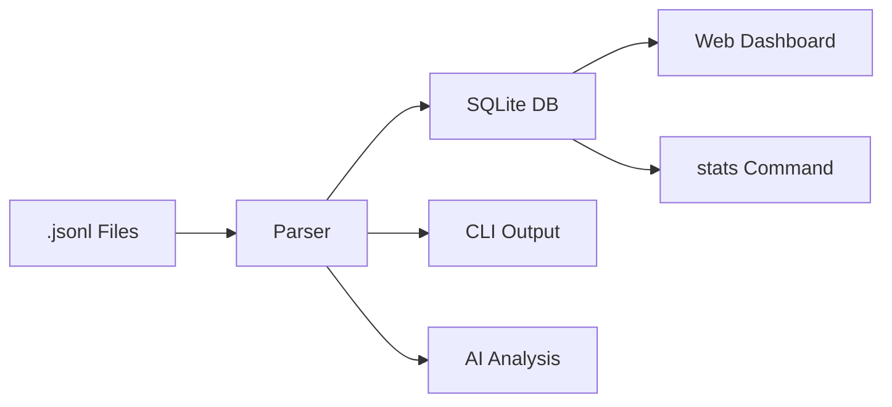

[English](README.md) | [中文](README.zh.md)

# Agent Trajectory Profiler

Visualize and analyze Claude Code agent sessions — run as a **web dashboard**, use **headless CLI** for batch processing, or invoke **AI-powered analysis** for actionable insights.

Parses `.jsonl` session files from `~/.claude/projects/`, computes analytics (message stats, tool usage, token consumption, time attribution, subagent tracking), and presents them through an interactive React frontend, structured JSON output, or AI-generated Markdown reports.

## Features

- **Multi-mode CLI** — `serve` / `parse` / `sync` / `stats` / `analyze`
- **Three output detail levels** — L1 one-liner, L2 standard, L3 full detail
- **Time attribution** — model inference / tool execution / user idle / inactive
- **Bottleneck detection** — identifies dominant time category
- **Automation ratio** — tool calls per human interaction
- **Configurable thresholds** — inactivity cutoff, model timeout detection
- **Bash command breakdown** — per-command count, latency, output size
- **MCP tool grouping** — aggregate multi-tool MCP servers
- **Subagent tracking** — nested agent session analysis
- **Auto-compact detection** — context window compaction events
- **SQLite persistence** — incremental sync with mtime-based change detection
- **Interactive web dashboard** — React frontend with charts and timeline
- **AI analysis reports** — Claude-powered Markdown insights



## Installation

### Prerequisites

- Python 3.10+
- [UV](https://github.com/astral-sh/uv) package manager
- Node.js 18+ (only needed for web dashboard)

### Install globally

```bash
git clone https://github.com/Devil-SX/agent-trajectory-profiler.git
cd agent-trajectory-profiler
uv sync
./install.sh
```

After installation, both commands are available globally:

- `agent-vis` (canonical)
- `claude-vis` (legacy compatibility alias)

To uninstall:
```bash
./uninstall.sh
```

### Install locally (without global command)

```bash
git clone https://github.com/Devil-SX/agent-trajectory-profiler.git
cd agent-trajectory-profiler
uv sync
```

Use `uv run agent-vis` for new scripts (recommended).  
`uv run claude-vis` remains supported as a compatibility alias.

## Migration Notes (`claude_vis` -> `agent_vis`)

- Canonical Python package namespace is now `agent_vis`.
- Canonical CLI command is now `agent-vis`.
- Legacy `claude_vis` imports and `claude-vis` command remain supported during migration.
- Deprecation path: `claude_vis` / `claude-vis` remain backward-compatible throughout `0.x`; removal (if any) will only happen in a future major release with explicit release notes.

## Usage

### Mode 1: Web Dashboard (`serve`)

Start a web server with an interactive visualization UI.

```bash
claude-vis serve
```

Opens at `http://localhost:8000` with:
- Session list with search and sorting
- Message timeline (user/assistant conversation flow)
- Subagent visualization with status indicators
- Statistics dashboard: message counts, tool usage charts, token consumption, timing heatmaps
- Responsive layout for desktop/tablet/mobile

**Options:**

```bash
claude-vis serve --port 8080                    # custom port
claude-vis serve --path /path/to/sessions       # custom session directory
claude-vis serve --single-session abc123        # load one session only
claude-vis serve --reload --log-level debug     # dev mode with hot reload
```

Frontend is auto-built on first run (requires Node.js). API docs available at `/docs`.

### Mode 2: Headless CLI (`parse`)

Parse session data and output structured JSON — no server, no browser needed.

```bash
claude-vis parse
```

Reads all `.jsonl` files from `~/.claude/projects/` and writes JSON to stdout.

**Options:**

```bash
claude-vis parse --file session.jsonl --human      # human-readable statistics
claude-vis parse --file session.jsonl               # JSON to stdout
claude-vis parse --output sessions.json             # write to file
claude-vis parse --compact | jq '.sessions[0]'      # pipe to jq
```

The `--level` flag controls detail depth: `1` = one-line summary, `2` = standard (default), `3` = detailed.

```bash
claude-vis parse --file session.jsonl --human --level 1    # one-liner per session
claude-vis parse --file session.jsonl --human --level 3    # all tools, all bash cmds, compact events
```

This mode is useful for:
- Scripting and automation pipelines
- Batch processing multiple sessions
- Exporting data for external analysis tools
- CI/CD integration

### Mode 3: Incremental Sync (`sync`)

Scan session directories, detect new/changed files by mtime + size, parse them, and persist results into an SQLite database (`~/.claude-vis/profiler.db`).

```bash
claude-vis sync                                        # scan default directory
claude-vis sync --path ~/.claude/projects/my-proj/     # specific directory
claude-vis sync --force                                # re-parse everything
```

### Mode 4: Database Stats (`stats`)

Query the SQLite database to view session statistics without re-parsing.

```bash
claude-vis stats --level 1                            # one-liner summary of all sessions
claude-vis stats --session-id abc123 --level 3        # full detail for one session
claude-vis stats --sort-by total_tokens --limit 10    # top 10 by token usage
```

### Mode 5: AI Analysis (`analyze`)

Invoke Claude to read the raw trajectory and produce an actionable Markdown report with bottleneck analysis, automation degree rating, and improvement recommendations.

```bash
claude-vis analyze --file session.jsonl
```

Requires `claude` CLI in PATH.

**Options:**

```bash
claude-vis analyze --file session.jsonl --lang cn          # Chinese report
claude-vis analyze --file session.jsonl --model sonnet     # specify model
claude-vis analyze --file session.jsonl -o report.md       # custom output path
```

Output defaults to `output/<session_id>_analysis.md`.

## Architecture

See [ARCHITECTURE.md](./ARCHITECTURE.md) for developer documentation.

## API Endpoints

When running in `serve` mode:

| Endpoint | Description |
|---|---|
| `GET /api/sessions` | List all sessions |
| `GET /api/sessions/{id}` | Session detail with messages and subagents |
| `GET /api/sessions/{id}/statistics` | Computed analytics for a session |
| `GET /api/sync/status` | Sync database status |
| `GET /health` | Health check |
| `GET /docs` | Interactive Swagger UI |

## Core Methodology

### Time Attribution

Session time is broken down by analyzing gaps between consecutive messages:
- **Model time** — gap before an assistant message (inference latency)
- **Tool time** — gap before a user message containing `tool_result` blocks (tool execution)
- **User time** — gap before a user message without tool results (human thinking/typing)
- **Inactive time** — any gap exceeding 30 minutes (app closed, AFK, sleeping)

Percentages are computed over *active time* only (excluding inactive gaps).

### Bottleneck Analysis

The category with the largest share of active time is reported as the bottleneck:
- **Model** — inference is the dominant cost; consider smaller models or prompt optimization
- **Tool** — tool execution dominates; look for slow file reads, network calls, or heavy bash commands
- **User** — human response time dominates; the agent is waiting on you

### Automation Ratio

`tool_calls / user_interactions` — measures how many tool invocations the agent performs per genuine human interaction. Higher ratios indicate more autonomous operation.

### Output Levels

| Level | Name | Description |
|-------|------|-------------|
| 1 | Summary | Single line: `session_id \| duration \| tokens \| bottleneck \| automation` |
| 2 | Standard | Messages, tokens, top tools, time breakdown, duration (default `--human`) |
| 3 | Detailed | Everything in L2 plus all tools, all bash commands, compact events |

## Development

```bash
# Backend with hot reload
claude-vis serve --reload --log-level debug

# Frontend dev server (separate terminal)
cd frontend && npm run dev

# Run tests
uv run pytest

# Lint & format
uv run ruff check .
uv run black .
uv run mypy .
```

## License

MIT
