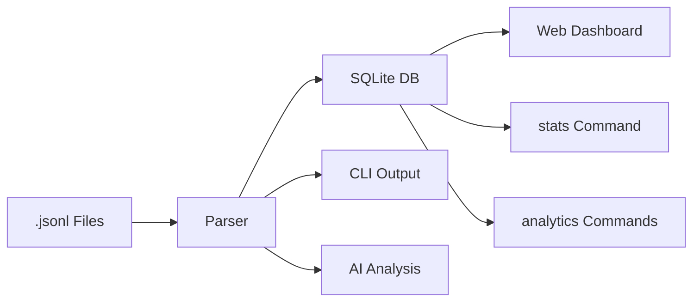

[English](README.md) | [中文](README.zh.md)

# Agent Trajectory Profiler

Visualize and analyze Claude Code agent sessions — run as a **web dashboard**, use **headless CLI** for batch processing, or invoke **AI-powered analysis** for actionable insights.

Parses `.jsonl` session files from `~/.claude/projects/`, computes analytics (message stats, tool usage, token consumption, time attribution, subagent tracking), and presents them through an interactive React frontend, structured JSON output, or AI-generated Markdown reports.

## Features

- **Multi-mode CLI** — `serve` / `parse` / `sync` / `stats` / `analytics` / `analyze`
- **Three output detail levels** — L1 one-liner, L2 standard, L3 full detail
- **Time attribution** — model inference / tool execution / user idle / inactive
- **Bottleneck detection** — identifies dominant time category
- **Automation ratio** — tool calls per human interaction
- **Configurable thresholds** — inactivity cutoff, model timeout detection
- **Bash command breakdown** — per-command count, latency, output size
- **MCP tool grouping** — aggregate multi-tool MCP servers
- **Subagent tracking** — nested agent session analysis
- **Auto-compact detection** — context window compaction events
- **SQLite persistence** — incremental sync with mtime-based change detection
- **Interactive web dashboard** — React frontend with charts and timeline
- **AI analysis reports** — Claude-powered Markdown insights



## Installation

### Prerequisites

- Python 3.10+
- [UV](https://github.com/astral-sh/uv) package manager
- Node.js 18+ (only needed for web dashboard)
- Rust toolchain when building from source (the package now includes a required native character-classifier extension)

### Install globally

```bash
git clone https://github.com/Devil-SX/agent-trajectory-profiler.git
cd agent-trajectory-profiler
uv sync
./install.sh
```

After installation, this command is available globally:

- `agent-vis`

To uninstall:
```bash
./uninstall.sh
```

### Install locally (without global command)

```bash
git clone https://github.com/Devil-SX/agent-trajectory-profiler.git
cd agent-trajectory-profiler
uv sync
```

Use `uv run agent-vis` in local scripts.

## Breaking Change in 1.0.0

- Legacy `claude_vis` Python package imports were removed.
- Legacy `claude-vis` CLI command alias was removed.
- Canonical namespace and command are now `agent_vis` and `agent-vis`.

## Usage

### Mode 1: Web Dashboard (`serve`)

Start a web server with an interactive visualization UI.

```bash
agent-vis serve
```

Opens at `http://localhost:8000` with:
- Session list with search and sorting
- Message timeline (user/assistant conversation flow)
- Subagent visualization with status indicators
- Statistics dashboard: message counts, tool usage charts, token consumption, timing heatmaps
- Responsive layout for desktop/tablet/mobile

**Options:**

```bash
agent-vis serve --port 8080                    # custom port
agent-vis serve --path /path/to/sessions       # custom session directory
agent-vis serve --single-session abc123        # load one session only
agent-vis serve --reload --log-level debug     # dev mode with hot reload
```

Frontend is auto-built on first run (requires Node.js). API docs available at `/docs`.

### Mode 2: Headless CLI (`parse`)

Parse session data and output structured JSON — no server, no browser needed.

```bash
agent-vis parse
```

Reads all `.jsonl` files from `~/.claude/projects/` and writes JSON to stdout.

**Options:**

```bash
agent-vis parse --file session.jsonl --human      # human-readable statistics
agent-vis parse --file session.jsonl               # JSON to stdout
agent-vis parse --output sessions.json             # write to file
agent-vis parse --compact | jq '.sessions[0]'      # pipe to jq
```

The `--level` flag controls detail depth: `1` = one-line summary, `2` = standard (default), `3` = detailed.

```bash
agent-vis parse --file session.jsonl --human --level 1    # one-liner per session
agent-vis parse --file session.jsonl --human --level 3    # all tools, all bash cmds, compact events
```

This mode is useful for:
- Scripting and automation pipelines
- Batch processing multiple sessions
- Exporting data for external analysis tools
- CI/CD integration

### Mode 3: Incremental Sync (`sync`)

Scan session directories, detect new/changed files by mtime + size, parse them, and persist results into an SQLite database (`~/.agent-vis/profiler.db`).

```bash
agent-vis sync                                        # scan default directory
agent-vis sync --path ~/.claude/projects/my-proj/     # specific directory
agent-vis sync --force                                # re-parse everything
agent-vis sync --summaries --summary-workers 4        # generate bounded plain-text summaries via Codex
agent-vis sync --embeddings                           # embed persisted summaries via OpenRouter
agent-vis sync --summaries --embeddings               # generate summaries, then embed them in the same run
```

When `--summaries` is enabled, sync runs a post-parse worker pool that builds a provider-agnostic `SessionSynopsis`, calls `codex exec --ephemeral` headlessly, truncates the plain-text output to the repository budget, and stores summary metadata in SQLite for incremental reuse. This stage is failure-isolated from parse/statistics persistence.

When `--embeddings` is enabled, sync reads completed rows from `session_summaries`, sends the bounded plain-text `summary_text` to OpenRouter's embeddings API, and stores vector metadata in SQLite for later similarity analysis. Raw session payloads are never sent to the embedding provider. Re-embedding is skipped when both the persisted summary fingerprint and embedding model are unchanged, and embedding failures do not roll back parse/statistics/summary writes.

OpenRouter configuration contract:

- `OPENROUTER_API_KEY` (required): bearer token used for embedding requests
- `OPENROUTER_BASE_URL` (optional): override the default `https://openrouter.ai/api/v1`
- `OPENROUTER_HTTP_REFERER` (optional): forwarded as `HTTP-Referer`
- `OPENROUTER_X_TITLE` (optional): forwarded as `X-Title`

Embedding request controls:

- `--embedding-model`: model ID, defaults to `openai/text-embedding-3-small`
- `--embedding-timeout`: per-request timeout in seconds
- `--embedding-max-retries`: retries for transient `429`, `5xx`, and network failures
- `--embedding-workers`: concurrent embedding workers

### Mode 4: Database Stats (`stats`)

Query the SQLite database to view session statistics without re-parsing.

```bash
agent-vis stats --level 1                            # one-liner summary of all sessions
agent-vis stats --session-id abc123 --level 3        # full detail for one session
agent-vis stats --sort-by total_tokens --limit 10    # top 10 by token usage
```

### Mode 5: Read-Only API Parity (`sessions`, `sync-status`, `capabilities`, `frontend-preferences`)

Inspect the same structured read models used by the REST API without starting the web server. These commands are read-only and do not trigger `sync` or `dashboard`.

```bash
agent-vis sessions list --page 1 --page-size 20 --view logical
agent-vis sessions get abc123
agent-vis sessions statistics abc123
agent-vis stats --session-id abc123 --json
agent-vis sync-status
agent-vis capabilities
agent-vis frontend-preferences
```

Use `agent-vis sessions list` when you want API-shaped pagination/filter output. Keep `agent-vis stats` for human-readable terminal summaries, or add `--json` for exact `/api/sessions/{id}/statistics` parity.

### Mode 6: Cross-Session Analytics (`analytics`)

Query the same aggregated cross-session analytics payloads exposed by the REST API, directly from the terminal as machine-readable JSON.

```bash
agent-vis analytics overview
agent-vis analytics distributions --dimension tool --ecosystem codex
agent-vis analytics timeseries --interval week --start-date 2026-03-01 --end-date 2026-03-07
agent-vis analytics project-comparison --limit 15
agent-vis analytics project-swimlane --interval week --project-limit 8
```

All analytics subcommands align with the API's default `last 7 days` behavior when no date range is supplied, and they accept `--db-path` for querying a non-default SQLite database.

### Mode 7: AI Analysis (`analyze`)

Invoke Claude to read the raw trajectory and produce an actionable Markdown report with bottleneck analysis, automation degree rating, and improvement recommendations.

```bash
agent-vis analyze --file session.jsonl
```

Requires `claude` CLI in PATH.

**Options:**

```bash
agent-vis analyze --file session.jsonl --lang cn          # Chinese report
agent-vis analyze --file session.jsonl --model sonnet     # specify model
agent-vis analyze --file session.jsonl -o report.md       # custom output path
```

Output defaults to `output/<session_id>_analysis.md`.

## Architecture

See [ARCHITECTURE.md](./ARCHITECTURE.md) for developer documentation.

## API Endpoints

When running in `serve` mode:

| Endpoint | Description |
|---|---|
| `GET /api/sessions` | List all sessions |
| `GET /api/sessions/{id}` | Session detail with messages and subagents |
| `GET /api/sessions/{id}/statistics` | Computed analytics for a session |
| `GET /api/sync/status` | Sync database status |
| `GET /api/analytics/overview` | Cross-session overview metrics |
| `GET /api/analytics/distributions` | Bottleneck/project/tool distribution metrics |
| `GET /api/analytics/timeseries` | Day/week activity trends |
| `GET /api/analytics/project-comparison` | Project-level KPI comparison |
| `GET /api/analytics/project-swimlane` | Project swimlane visualization data |
| `GET /health` | Health check |
| `GET /docs` | Interactive Swagger UI |

## Core Methodology

### Time Attribution

Session time is broken down by analyzing gaps between consecutive messages:
- **Model time** — gap before an assistant message (inference latency)
- **Tool time** — gap before a user message containing `tool_result` blocks (tool execution)
- **User time** — gap before a user message without tool results (human thinking/typing)
- **Inactive time** — any gap exceeding 30 minutes (app closed, AFK, sleeping)

Percentages are computed over *active time* only (excluding inactive gaps).

### Bottleneck Analysis

The category with the largest share of active time is reported as the bottleneck:
- **Model** — inference is the dominant cost; consider smaller models or prompt optimization
- **Tool** — tool execution dominates; look for slow file reads, network calls, or heavy bash commands
- **User** — human response time dominates; the agent is waiting on you

### Automation Ratio

`tool_calls / user_interactions` — measures how many tool invocations the agent performs per genuine human interaction. Higher ratios indicate more autonomous operation.

### Output Levels

| Level | Name | Description |
|-------|------|-------------|
| 1 | Summary | Single line: `session_id \| duration \| tokens \| bottleneck \| automation` |
| 2 | Standard | Messages, tokens, top tools, time breakdown, duration (default `--human`) |
| 3 | Detailed | Everything in L2 plus all tools, all bash commands, compact events |

## Development

```bash
# Start backend + frontend together (recommended)
agent-vis dashboard --reload --log-level debug

# Optional: run separately in two terminals
agent-vis serve --reload --log-level debug
cd frontend && npm run dev

# Regenerate frontend API contract types from backend OpenAPI schema
npm --prefix frontend run typegen

# CI-style freshness check (fails if generated files are stale)
npm --prefix frontend run typegen:check

# Backend performance quick profile (PR-oriented soft gate)
uv run python scripts/run_backend_perf.py --mode quick

# Backend performance full profile (nightly trend)
uv run python scripts/run_backend_perf.py --mode full

# Run tests
uv run pytest

# Lint & format
uv run ruff check .
uv run black .
uv run mypy .
```

Frontend API contracts are generated artifacts and should be committed. When backend API models/routes change, regenerate with `npm --prefix frontend run typegen`, commit updated files under `frontend/src/types/generated/`, and keep `typegen:check` green in CI.

Backend performance artifacts and budget policy are documented in `docs/performance.md`.

## License

MIT
