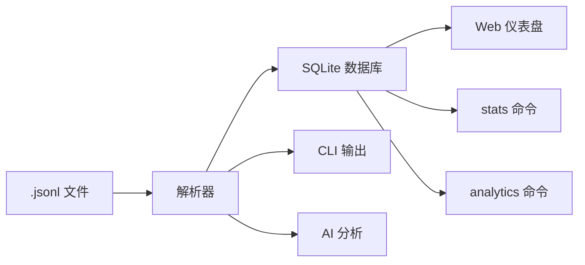

[English](README.md) | [中文](README.zh.md)

# Agent Trajectory Profiler

可视化与分析 Claude Code 智能体会话 —— 支持 **Web 仪表盘**、**无头 CLI** 批量处理，以及 **AI 驱动分析** 生成可操作的洞察报告。

解析 `~/.claude/projects/` 下的 `.jsonl` 会话文件，计算分析指标（消息统计、工具使用、Token 消耗、时间归因、子智能体追踪），通过交互式 React 前端、结构化 JSON 输出或 AI 生成的 Markdown 报告呈现结果。

## 功能特性

- **多模式 CLI** — `serve` / `parse` / `sync` / `stats` / `analytics` / `analyze`
- **三级输出详细度** — L1 单行摘要、L2 标准、L3 完整详情
- **时间归因** — 模型推理 / 工具执行 / 用户空闲 / 非活跃
- **瓶颈检测** — 识别主要耗时类别
- **自动化比率** — 每次人类交互的工具调用数
- **可配置阈值** — 非活跃判定阈值、模型超时检测
- **Bash 命令分解** — 按命令统计次数、延迟、输出大小
- **MCP 工具分组** — 聚合多工具 MCP 服务器
- **子智能体追踪** — 嵌套智能体会话分析
- **自动紧凑检测** — 上下文窗口压缩事件
- **SQLite 持久化** — 基于 mtime 的增量同步
- **交互式 Web 仪表盘** — React 前端，含图表和时间线
- **AI 分析报告** — Claude 驱动的 Markdown 洞察



## 安装

### 前置条件

- Python 3.10+
- [UV](https://github.com/astral-sh/uv) 包管理器
- Node.js 18+（仅 Web 仪表盘需要）

### 全局安装

```bash
git clone https://github.com/Devil-SX/agent-trajectory-profiler.git
cd agent-trajectory-profiler
uv sync
./install.sh
```

安装后可在任意目录使用以下命令：

- `agent-vis`

卸载：
```bash
./uninstall.sh
```

### 本地安装（不注册全局命令）

```bash
git clone https://github.com/Devil-SX/agent-trajectory-profiler.git
cd agent-trajectory-profiler
uv sync
```

本地脚本中使用 `uv run agent-vis`。

## 1.0.0 破坏性变更

- 已移除旧的 `claude_vis` Python 包导入路径。
- 已移除旧的 `claude-vis` CLI 命令别名。
- 当前规范命名空间与命令分别为 `agent_vis` 和 `agent-vis`。

## 使用方式

### 模式一：Web 仪表盘 (`serve`)

启动 Web 服务器，提供交互式可视化界面。

```bash
agent-vis serve
```

在 `http://localhost:8000` 打开，包含：
- 会话列表（支持搜索和排序）
- 消息时间线（用户/助手对话流）
- 子智能体可视化（含状态指示器）
- 统计仪表盘：消息计数、工具使用图表、Token 消耗、时间热力图
- 响应式布局（桌面/平板/手机）

**选项：**

```bash
agent-vis serve --port 8080                    # 自定义端口
agent-vis serve --path /path/to/sessions       # 自定义会话目录
agent-vis serve --single-session abc123        # 仅加载单个会话
agent-vis serve --reload --log-level debug     # 开发模式（热重载）
```

首次运行时自动构建前端（需要 Node.js）。API 文档见 `/docs`。

### 模式二：无头 CLI (`parse`)

解析会话数据并输出结构化 JSON —— 无需服务器或浏览器。

```bash
agent-vis parse
```

读取 `~/.claude/projects/` 下所有 `.jsonl` 文件，将 JSON 输出到标准输出。

**选项：**

```bash
agent-vis parse --file session.jsonl --human      # 人类可读的统计信息
agent-vis parse --file session.jsonl               # JSON 输出到 stdout
agent-vis parse --output sessions.json             # 写入文件
agent-vis parse --compact | jq '.sessions[0]'      # 管道传递给 jq
```

`--level` 标志控制详细程度：`1` = 单行摘要，`2` = 标准（默认），`3` = 详细。

```bash
agent-vis parse --file session.jsonl --human --level 1    # 每个会话一行摘要
agent-vis parse --file session.jsonl --human --level 3    # 所有工具、所有 bash 命令、紧凑事件
```

适用场景：
- 脚本和自动化流水线
- 批量处理多个会话
- 导出数据供外部分析工具使用
- CI/CD 集成

### 模式三：增量同步 (`sync`)

扫描会话目录，通过 mtime + size 检测新增/变化的文件，解析后持久化到 SQLite 数据库 (`~/.agent-vis/profiler.db`)。

```bash
agent-vis sync                                        # 扫描默认目录
agent-vis sync --path ~/.claude/projects/my-proj/     # 指定目录
agent-vis sync --force                                # 强制全量重新解析
```

### 模式四：数据库统计 (`stats`)

从 SQLite 数据库查询会话统计信息，无需重新解析。

```bash
agent-vis stats --level 1                            # 所有会话的单行摘要
agent-vis stats --session-id abc123 --level 3        # 单个会话的完整详情
agent-vis stats --sort-by total_tokens --limit 10    # 按 Token 用量排序的前 10 个
```

### 模式五：跨会话分析 (`analytics`)

直接在终端查询与 REST API 等价的跨会话聚合分析结果，输出为机器可读 JSON。

```bash
agent-vis analytics overview
agent-vis analytics distributions --dimension tool --ecosystem codex
agent-vis analytics timeseries --interval week --start-date 2026-03-01 --end-date 2026-03-07
agent-vis analytics project-comparison --limit 15
agent-vis analytics project-swimlane --interval week --project-limit 8
```

如果未指定日期范围，所有 analytics 子命令默认与 API 一致，查询最近 7 天数据；同时支持 `--db-path` 指向非默认 SQLite 数据库。

### 模式六：AI 分析 (`analyze`)

调用 Claude 阅读原始轨迹，生成包含瓶颈分析、自动化程度评级和改进建议的 Markdown 报告。

```bash
agent-vis analyze --file session.jsonl
```

需要 `claude` CLI 在 PATH 中。

**选项：**

```bash
agent-vis analyze --file session.jsonl --lang cn          # 中文报告
agent-vis analyze --file session.jsonl --model sonnet     # 指定模型
agent-vis analyze --file session.jsonl -o report.md       # 自定义输出路径
```

默认输出到 `output/<session_id>_analysis.md`。

## 架构

详见 [ARCHITECTURE.md](./ARCHITECTURE.md)。

## API 端点

`serve` 模式下可用：

| 端点 | 说明 |
|---|---|
| `GET /api/sessions` | 会话列表 |
| `GET /api/sessions/{id}` | 会话详情（含消息和子智能体） |
| `GET /api/sessions/{id}/statistics` | 会话的计算分析指标 |
| `GET /api/sync/status` | 同步数据库状态 |
| `GET /api/analytics/overview` | 跨会话总览指标 |
| `GET /api/analytics/distributions` | 瓶颈 / 项目 / 工具分布指标 |
| `GET /api/analytics/timeseries` | 按天 / 周聚合的趋势数据 |
| `GET /api/analytics/project-comparison` | 项目级 KPI 对比 |
| `GET /api/analytics/project-swimlane` | 项目泳道图数据 |
| `GET /health` | 健康检查 |
| `GET /docs` | 交互式 Swagger UI |

## 分析方法论

### 时间归因

通过分析连续消息之间的间隔来分解会话时间：
- **模型时间** — 助手消息前的间隔（推理延迟）
- **工具时间** — 包含 `tool_result` 的用户消息前的间隔（工具执行）
- **用户时间** — 不含工具结果的用户消息前的间隔（人类思考/输入）
- **非活跃时间** — 超过 30 分钟的任何间隔（应用关闭、离开、休息）

百分比仅基于*活跃时间*计算（排除非活跃间隔）。

### 瓶颈分析

活跃时间占比最大的类别被报告为瓶颈：
- **模型** — 推理是主要耗时；考虑使用更小的模型或优化提示词
- **工具** — 工具执行占主导；检查慢速文件读取、网络调用或重型 bash 命令
- **用户** — 人类响应时间占主导；智能体在等待你

### 自动化比率

`tool_calls / user_interactions` — 衡量智能体每次人类交互执行多少次工具调用。比率越高表示自主运行程度越高。

### 输出级别

| 级别 | 名称 | 说明 |
|------|------|------|
| 1 | 摘要 | 单行：`session_id \| 时长 \| tokens \| 瓶颈 \| 自动化` |
| 2 | 标准 | 消息、Token、热门工具、时间分解、时长（`--human` 默认） |
| 3 | 详细 | 标准级基础上加全部工具、全部 bash 命令、紧凑事件 |

## 开发

```bash
# 一条命令同时启动前后端（推荐）
agent-vis dashboard --reload --log-level debug

# 也可分两个终端分别启动
agent-vis serve --reload --log-level debug
cd frontend && npm run dev

# 后端性能 quick 档（PR 场景，软门禁）
uv run python scripts/run_backend_perf.py --mode quick

# 后端性能 full 档（夜间趋势）
uv run python scripts/run_backend_perf.py --mode full

# 运行测试
uv run pytest

# 代码检查与格式化
uv run ruff check .
uv run black .
uv run mypy .
```

后端性能预算、指标口径与 CI 产物说明见 `docs/performance.md`。

## 许可证

MIT
